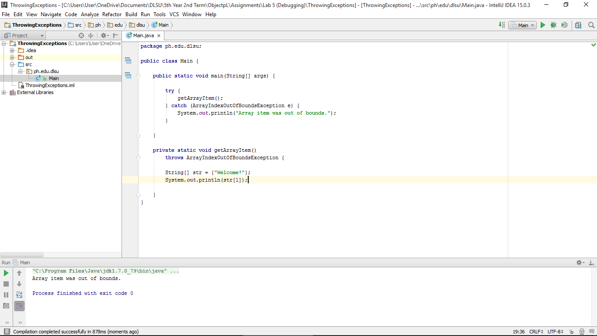

#ThrowingExceptions

Placing Exceptions in a separate Method

#ScreenShot

#Code

~~~
package ph.edu.dlsu;

public class Main {

    public static void main(String[] args) {

        try {
            getArrayItem();
        } catch (ArrayIndexOutOfBoundsException e) {
            System.out.println("Array item was out of bounds.");
        }

    }

    private static void getArrayItem()
        throws ArrayIndexOutOfBoundsException {

        String[] str = {"Welcome!"};
        System.out.println(str[1]);

    }
}
~~~
